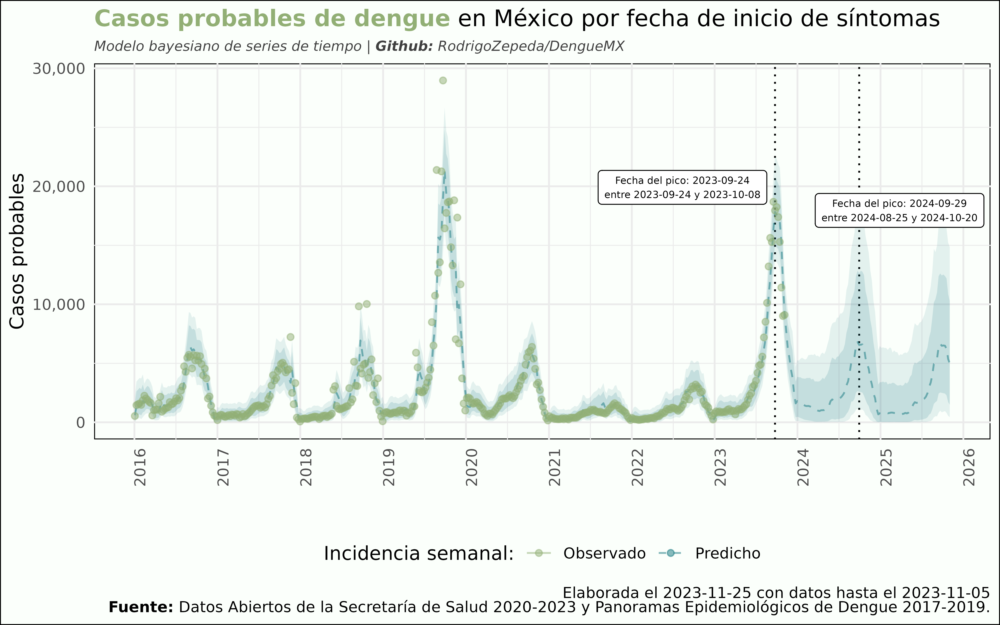

# DengueMX

Repositorio de los datos abiertos y scrappeados de dengue en México junto con modelo de predicción de casos.

+ `datos-abiertos` contienen los datos abiertos (históricos) de la DGE y su diccionario.
    + `datos_abiertos_dengue_*.zip` base de datos decargada de la [Dirección General de Epidemiología](https://www.gob.mx/salud/documentos/datos-abiertos-bases-historicas-de-enfermedades-transmitidas-por-vector) correspondiente a la fecha `*`.
    + `diccionario` archivo con el diccionario de los datos (descargado el 19 de mayo 2022) contiene dos bases: 
        + `Descriptores_Dengue.xlsx` con los descriptores de las variables.
        + `Catalogos_Dengue.xlsx` con el catálogo de variables.    
+ `datos-limpios` contiene la base de datos de 2016 a 2022 de los datos de dengue ya limpios en formato tidy
    + `dengue_2016_2022_mx.rds` base de datos con la información de dengue desde el registro de las semanas epidemiológicas de `2016`hasta el `2022`. Para leer usa `readr::read_rds`.
    + `dengue_2016_2022_mx.csv` base de datos con la información de dengue desde el registro de las semanas epidemiológicas de `2016`hasta el `2022`. Para leer usa `readr::read_csv` con `UTF-8` de encoding.
    + `dengue_for_model_mx.csv` contiene los datos de dengue de 2015 a la fecha con los datos de las semanas faltantes interpolados así como transformaciones a log_casos. Es input para el modelo. 
+ `datos-clima` contiene las bases de datos de 1985 a 2022 de precipitación promedio por entidad y temperaturas (mínima, máxima y promedio) por mes. Las bases de datos son descargadas de los resúmenes de [CONAGUA](https://smn.conagua.gob.mx/es/climatologia/temperaturas-y-lluvias/resumenes-mensuales-de-temperaturas-y-lluvias) para 2021-2022 así como de los [datos abiertos](https://datos.gob.mx/busca/dataset/temperatura-promedio-excel) para 1985-2019. 
    + `descarga_clima_1985_today.R` se encarga de descargar los datos de CONAGUA y de datos abiertos así como de usar `python` para procesar los `pdf` de CONAGUA (2021 en adelante). 
+ `panoramas_epidemiologicos_previos` contienen los `pdf` de anteriores panoramas epidemiológicos de dengue por año. 
    + `import` contiene el código de Python para importar los panoramas (un código por año).
    + `processed` contiene los datos scrappeados de los panoramas epidemiológicos previos
+ `scripts` para la descarga y el formateo de datos
    + `Descarga.py` para descarga diaria de los datos màs nuevos
    + `format_dataset.R` para correr los datos nuevos y ponerlos para el modelo
    + `model_bayes.R` el modelo

## Colabora

La meta es tener un (mejor) modelo de dengue aunque sea a nivel nacional para el próximo año. Éste es sólo una prueba de concepto. Si te interesa escríbeme o manda un pull request. Algunas cosas en las que podrías colaborar:

+ Descargar datos de años previos. 
+ Conseguir covariables para mejorar la predicción (ejemplo variables de clima).
+ Mejorar el modelo (por ahora es sólo uno de juguete por falta de tiempo). 