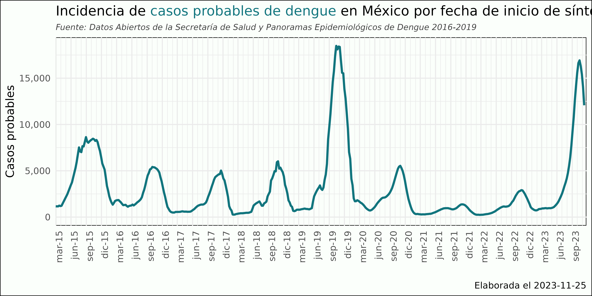

# DengueMX

Repositorio de los datos abiertos y scrappeados de dengue en México.

+ `datos-abiertos` contienen los datos abiertos (históricos) de la DGE y su diccionario.
+ `datos-limpios` contiene la base de datos de 2016 a 2022 de los datos de dengue ya limpiosen formato tidy
+ `panoramas_epidemiologicos_previos` contienen los `pdf` de anteriores panoramas epidemiológicos de dengue por año. 
    + `import` contiene el código de Python para importar los panoramas (un código por año).
    + `processed` contiene los datos scrappeados de los panoramas epidemiológicos previos
+ `scripts` para la descarga y el formateo de datos

## Colabora

La meta es tener un modelo trabajado de dengue aunque sea a nivel nacional para el próximo año. Si te interesa escríbeme. 